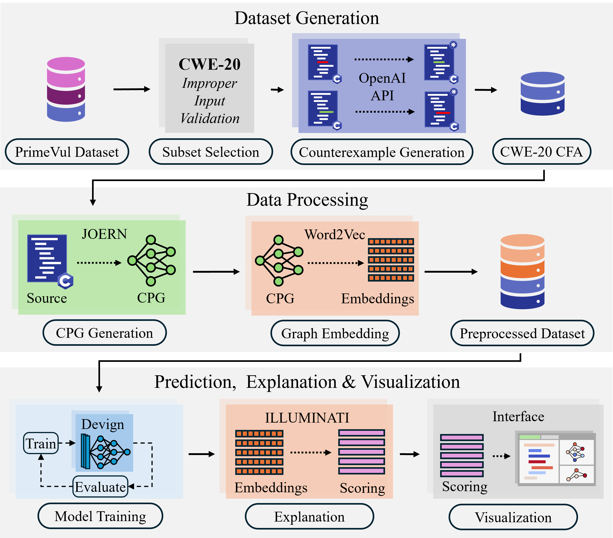
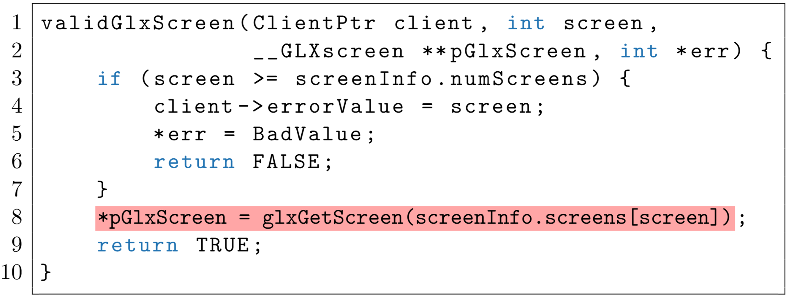
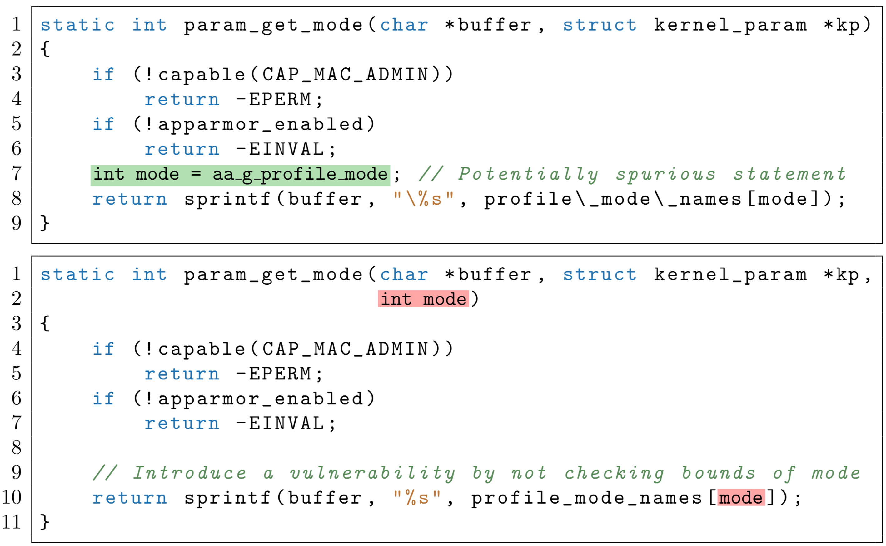
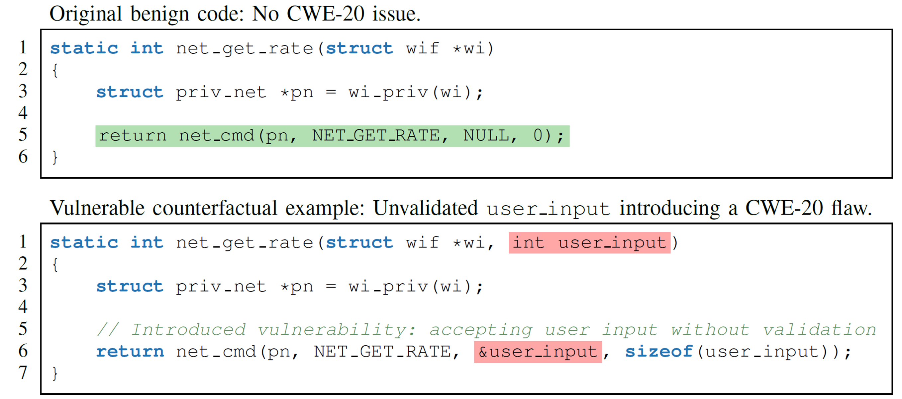
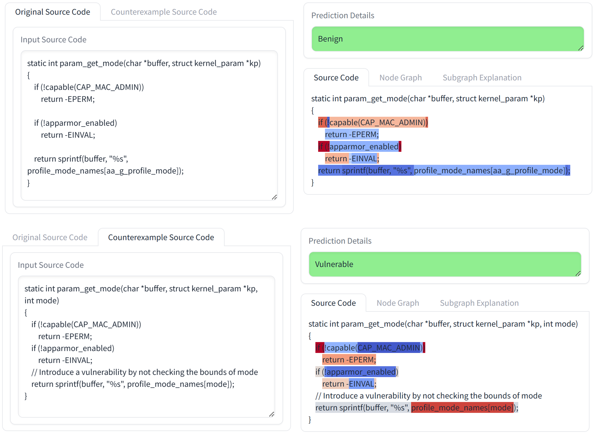
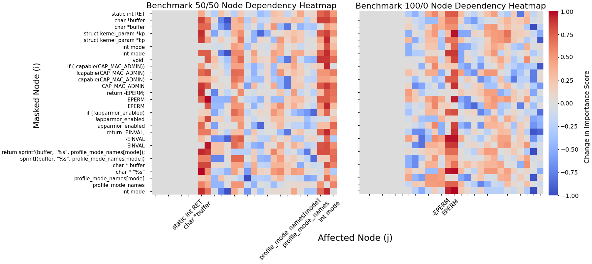
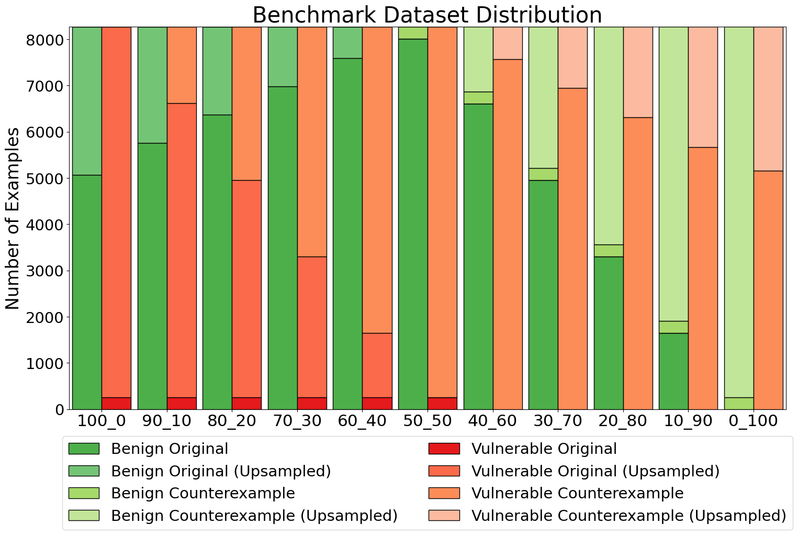

# VISION: Robust and Interpretable Code Vulnerability Detection via Counterfactual Augmentation

> **Accepted at [AAAI/ACM AIES 2025](https://www.aies-conference.com/2025/)**  
> 📄 [Read the paper](https://arxiv.org/pdf/2508.18933)  
> 💾 [Download the CWE-20-CFA Dataset on Hugging Face](https://huggingface.co/datasets/David-Egea/CWE-20-CFA)

---

## 🌟 Overview

**VISION** (Vulnerability Identification and Spuriousness Mitigation via Counterfactual Augmentation)  
is a unified framework for **robust and interpretable code vulnerability detection**.  
It reduces **spurious correlations** in Graph Neural Networks (GNNs) by generating **counterfactual examples** —  
functions minimally modified to flip their vulnerability labels (benign ↔ vulnerable).

VISION integrates:
- 🧩 **LLM-based Counterfactual Generation**
- ⚖️ **Balanced Dataset Construction (CWE-20-CFA)**
- 🔗 **Graph Representation with Joern**
- 🧠 **GNN Model (Devign)**
- 💡 **Explainability via Illuminati**
- 🔍 **Interactive Visualization Module**

---

## 🧩 Framework Pipeline

<p align="center">
  
</p>

1. **Dataset Filtering:** Extract CWE-20 (Improper Input Validation) samples from PrimeVul  
2. **Counterfactual Generation:** Use LLM prompts to flip vulnerability labels  
3. **Graph Construction:** Parse source code to Code Property Graphs (CPGs) via Joern  
4. **Embedding:** Encode nodes and edges using Word2Vec  
5. **Training:** Fine-tune a GNN model (Devign architecture)  
6. **Explanation:** Generate attributions via Illuminati  
7. **Visualization:** Explore explanations with an interactive interface

---

## 💾 Dataset: CWE-20-CFA

| Dataset | Benign | Vulnerable | Total |
|:--|:--:|:--:|:--:|
| PrimeVul (CWE-20 subset) | 14,473 | 471 | 14,944 |
| **CWE-20-CFA (ours)** | 13,778 | 13,778 | **27,556** |

Balanced through **counterfactual pairing** (one benign ↔ one vulnerable function).  
Dataset available at:  
📦 [Hugging Face: David-Egea/CWE-20-CFA](https://huggingface.co/datasets/David-Egea/CWE-20-CFA)

### 💡 Real-World CWE-20 Vulnerability Example

<p align="center">
  
</p>

The `validGlxScreen` function fails to validate negative screen indices,  
causing invalid array access and potential security issues.  
VISION uses such real CWE-20 instances from PrimeVul to construct  
balanced original–counterfactual training pairs.


## 🧩 Counterfactual and Spurious Correlation Examples

To illustrate the motivation behind VISION’s counterfactual augmentation strategy,  
we analyze two key examples drawn from the CWE-20 vulnerability domain.

---

### ⚠️ Spurious Correlation in Source Code

<p align="center">
  
</p>

**Illustration of spurious correlation in source code:**  
The **upper function** (benign) assigns a safe internal value to `mode`,  
while the **lower function** (vulnerable) takes `mode` as unchecked user input.  
Without sufficient counterfactuals, a model may **incorrectly associate the presence  
of the variable `mode` with safe behavior**, failing to recognize its misuse  
in the vulnerable case.  

This demonstrates how models trained on imbalanced or noisy datasets can  
learn **spurious statistical associations** that do not reflect real vulnerability semantics.

---

### 🔄 Counterfactual Code Pair for Data Augmentation

<p align="center">
  
</p>

**Figure: Illustration of a counterfactual code pair used in data augmentation.**  
The **top function** is *benign*, safely invoking `net_cmd()` with no external input.  
The **bottom function** introduces a CWE-20 *(Improper Input Validation)* vulnerability  
by replacing a fixed argument with **user-provided input** (`user_input`) that is  
passed without validation.  

These *minimally edited counterfactual pairs* encourage the model to focus on  
**true causal vulnerability patterns** rather than superficial syntax differences,  
forming the foundation of the **CWE-20-CFA** benchmark and enabling robust  
generalization against spurious correlations.

---

## 💬 Visualization and Explainability Interface

VISION integrates an **interactive visualization interface** that helps interpret GNN predictions and explanation scores.  
It highlights which parts of the code contribute most to the model’s vulnerability classification.

<p align="center">
  
</p>

**Explanation workflow:**
1. The **left panel** displays the *original* and *counterexample* code functions.  
2. The **right panel** shows model predictions (benign/vulnerable) with highlighted attributions.  
   - **Red** = high positive influence on vulnerability classification  
   - **Blue** = high negative influence  

These visual explanations enable researchers and practitioners to validate model decisions and understand vulnerability semantics at the source code level.

---

## 📊 Key Results

| Metric | Baseline | VISION (CWE-20-CFA) |
|:--|:--:|:--:|
| **Accuracy** | 51.8% | **97.8%** |
| **Pairwise Contrast Accuracy** | 4.5% | **95.8%** |
| **Worst-Group Accuracy** | 0.7% | **85.5%** |

### 📊 Comprehensive Results and Evaluation

The following table summarizes the performance of VISION across various training splits,
covering robustness, generalization, and explanation quality metrics.

| Split | P-C | P-V | P-B | P-R | WGA2 | WGA3 | WGA4 | WGA5 | WGA6 | WGA7 | Purity | Intra-B | Intra-V | Inter-D |
|:------:|:----:|:----:|:----:|:----:|:------:|:------:|:------:|:------:|:------:|:------:|:------:|:------:|:------:|:------:|
| 100/0 | 4.50 | 0.00 | 95.43 | 0.07 | 0.0171 | 0.0096 | 0.0073 | 0.0067 | 0.0058 | 0.0067 | 0.707 | 0.01103 | 0.01027 | 0.00061 |
| 90/10 | 74.09 | 1.38 | 23.88 | 0.65 | 0.7309 | 0.7156 | 0.7052 | 0.7126 | 0.5909 | 0.5952 | 0.907 | 0.01120 | 0.01035 | 0.00073 |
| 80/20 | 91.07 | 5.44 | 3.27 | 0.22 | **0.9115** | **0.8828** | **0.8757** | 0.8512 | 0.8444 | 0.8205 | 0.953 | 0.01096 | 0.01046 | 0.00027 |
| 70/30 | 94.63 | 4.86 | 0.36 | 0.15 | 0.9056 | 0.8745 | 0.8757 | 0.8595 | 0.8444 | 0.8205 | 0.962 | 0.01109 | 0.00995 | 0.00010 |
| 60/40 | 93.69 | 6.31 | 0.00 | 0.00 | 0.9056 | 0.8745 | 0.8703 | 0.8512 | 0.8444 | 0.8205 | **0.967** | 0.01134 | 0.01030 | 0.00010 |
| **50/50** | **95.79** | **0.44** | **0.00** | 3.77 | 0.8991 | 0.8667 | 0.8555 | 0.8087 | 0.7955 | 0.8095 | 0.944 | **0.01061** | 0.01030 | **0.00160** |
| 40/60 | 94.12 | 1.02 | 4.50 | 0.36 | 0.8471 | 0.8089 | 0.8092 | 0.7739 | 0.7955 | 0.8067 | 0.966 | 0.01122 | 0.01036 | 0.00017 |
| 30/70 | 87.52 | 8.13 | 3.85 | 0.51 | 0.8777 | 0.8400 | 0.8266 | 0.7739 | 0.7727 | 0.7857 | 0.941 | 0.01101 | 0.01010 | 0.00038 |
| 20/80 | 70.97 | 27.72 | 1.02 | 0.29 | 0.8820 | 0.8622 | 0.8497 | 0.8174 | 0.8182 | 0.8333 | 0.929 | 0.01144 | 0.01036 | 0.00028 |
| 10/90 | 77.94 | 20.54 | 0.65 | 0.87 | 0.8584 | 0.8350 | 0.8152 | 0.8265 | 0.8149 | 0.8099 | 0.910 | 0.01103 | 0.01046 | 0.00008 |
| 0/100 | 41.51 | 57.40 | 0.65 | 0.44 | 0.5398 | 0.4983 | 0.5030 | 0.4966 | 0.4754 | 0.4742 | 0.856 | 0.01122 | 0.01007 | 0.00099 |

**Table:** Comprehensive evaluation across training splits, covering robustness, generalization,  
and explanation quality. Metrics include:

- **Pair-wise Agreement** — P-C (correct contrast), P-V (both predicted vulnerable),  
  P-B (both predicted benign), P-R (flipped predictions).  
  Higher **P-C** and lower **P-V/P-B/P-R** indicate better discrimination.  
- **Worst-Group Accuracy (WGA, k = 2–7)** — higher is better, reflects subgroup robustness.  
- **Neighborhood Purity** — higher values indicate stronger class consistency and  
  better semantic separation in the embedding space.  
- **Attribution Metrics:**  
  - *Intra-class Attribution Variance* (lower = more consistent reasoning)  
  - *Inter-class Attribution Distance* (higher = better separability of explanations)

---

#### 🔹 Key Findings

- The **balanced 50/50** configuration achieves the **highest correct contrast (P-C = 95.79%)**  
  and **lowest intra-class variance**, confirming that counterfactual integration  
  yields the most robust and interpretable models.  
- Moderate augmentations (e.g., 60/40 or 70/30 splits) also show strong subgroup robustness  
  (WGA > 0.84 across k = 2–7) and high purity in the embedding space.  
- Fully imbalanced settings (100/0 or 0/100) lead to degraded performance and lower robustness,  
  demonstrating the necessity of counterfactual balancing.  

These results collectively show that **counterfactual augmentation mitigates spurious correlations**,  
improves generalization, and enhances explanation stability across multiple evaluation metrics.


### 🌐 Embedding Space Visualization

To evaluate the representation quality, we visualized the learned  
graph embeddings using **t-SNE** across different data splits.

<p align="center">
  
</p>

Balanced augmentation (50/50 original vs. counterfactual) leads to  
clearer class separation — vulnerable and benign samples  
form distinct clusters, confirming improved generalization.

## 🔍 Node Dependency and Explanation Insights

To analyze model reasoning, VISION introduces the **Node Score Dependency** metric,  
which quantifies how node importance in graph explanations depends on other nodes.  
It reveals whether the model focuses on meaningful vulnerability patterns  
or on spurious syntactic tokens.

<p align="center">
  
</p>

**Left:** Balanced (50/50) model — attention is distributed semantically across relevant nodes.  
**Right:** Unbalanced (100/0) model — attention collapses on irrelevant or constant tokens.  
This demonstrates that counterfactual augmentation improves attribution consistency  
and model robustness.

---

## ⚙️ Installation

```bash
# Clone this repository
git clone https://github.com/David-Egea/VISION.git
cd VISION

# Create conda environment
conda env create -f env.yml
conda activate vision

# Or install dependencies via pip
pip install -r requirements.txt
```

## ⚙️ Requirements

- **Python 3.9+**  
- **Joern** installed and available in your `PATH`  
- **PyTorch Geometric** for graph operations

---

## 🗂️ Repository Structure

```graphql
VISION/
├── benchmarks/                 # Processed datasets & splits
├── datasets/                   # Raw and counterfactual data
├── devign/                     # GNN model (Devign architecture)
├── joern/                      # Joern-based graph parsing
├── generate_counterexample_data/
├── graph2cpg.py                # Code → CPG
├── cpg2input.py                # CPG → PyG input
├── explainer.py                # Illuminati-based explainer
├── interface.py                # Visualization interface
├── train.py                    # Model training
├── metrics.ipynb               # Evaluation and plotting
├── env.yml / requirements.txt  # Environment setup
└── LICENSE / README.md
```

---

## 🧠 Baselines

- Model: [Devign](https://arxiv.org/abs/1909.03496) — GNN for vulnerability detection
- Explainer: [Illuminati](https://arxiv.org/abs/2303.14836) — graph-based explainability
- Augmentation: Counterfactual LLM-based pairing for CWE-20

---

## 📊 Benchmark Overview

<p align="center">
  
</p>

| Dataset | Benign | Vulnerable | Total |
|----------|:------:|:-----------:|:-----:|
| PrimeVul (CWE-20 subset) | 14,473 | 471 | 14,944 |
| **CWE-20-CFA (ours)** | 13,778 | 13,778 | **27,556** |

## 🧮 Data Splits

- **Recommended:** 80/10/10 split by **pair ID**, ensuring no cross-pair leakage.  
- Each original function has a **counterfactual counterpart** with the opposite label.

## 📦 Size

- **File:** single `.pkl` (~11 GB)  
- **Total samples:** 27,556 functions  
- **Balanced:** 13,778 benign / 13,778 vulnerable

--- 

## 📎 Links

- 📄 **Paper:** [arXiv Preprint](https://arxiv.org/abs/2508.18933)  
- 💾 **Dataset:** [Hugging Face — CWE-20-CFA](https://huggingface.co/datasets/David-Egea/CWE-20-CFA)  
- 💻 **Code Repository:** [GitHub — David-Egea/VISION](https://github.com/David-Egea/VISION)

---

## 📚 Citation

If you use this dataset, please cite the paper:

```bibtex
@misc{egea2025visionrobustinterpretablecode,
      title={VISION: Robust and Interpretable Code Vulnerability Detection Leveraging Counterfactual Augmentation}, 
      author={David Egea and Barproda Halder and Sanghamitra Dutta},
      year={2025},
      eprint={2508.18933},
      archivePrefix={arXiv},
      primaryClass={cs.AI},
      url={https://arxiv.org/abs/2508.18933}, 
}
```

---

## 👥 Maintainers

- **David Egea** — Universidad Pontificia Comillas / University of Maryland  
- **Barproda Halder** — University of Maryland  
- **Sanghamitra Dutta** — University of Maryland  

---

## ⚠️ Ethical & Safety Notes
 
> Models trained on this dataset should **not be used for production security analysis** without human validation.
"# DACN-kaggle" 
"# DACN-kaggle" 
"# DACN-kaggle" 
"# DACN-kaggle" 
